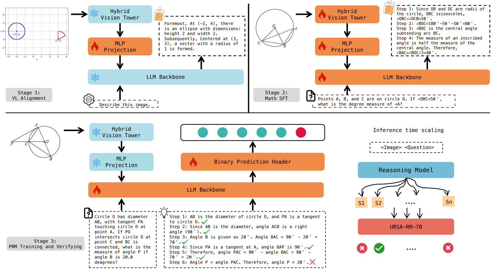
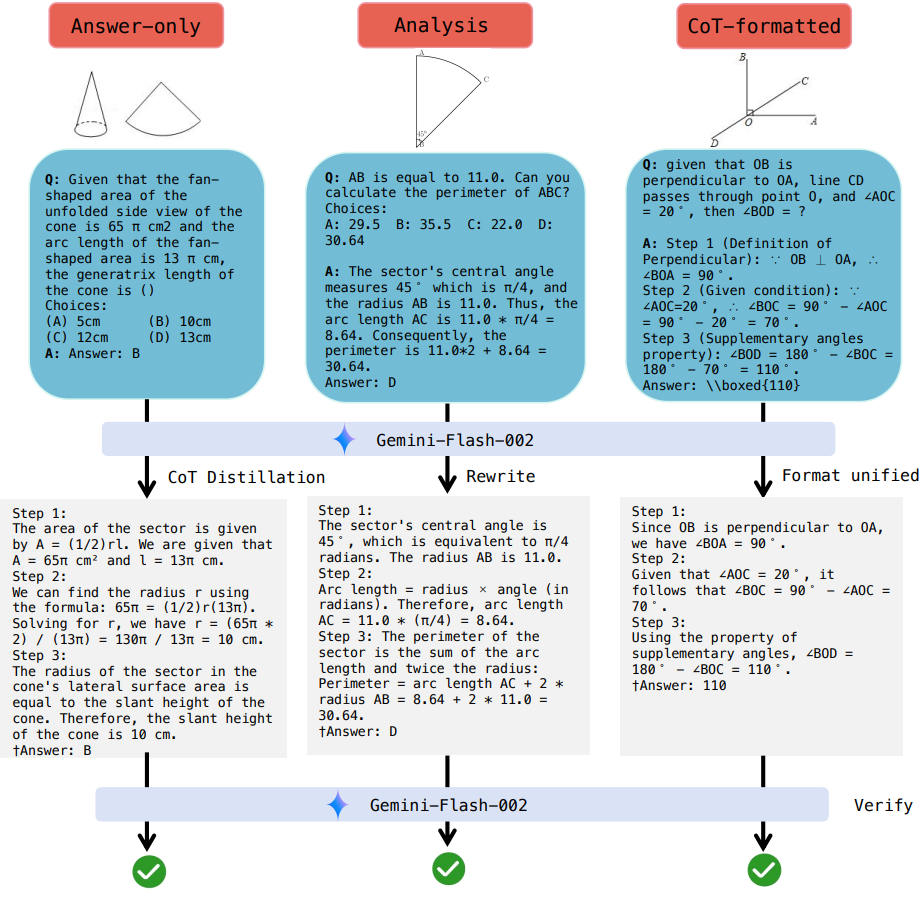
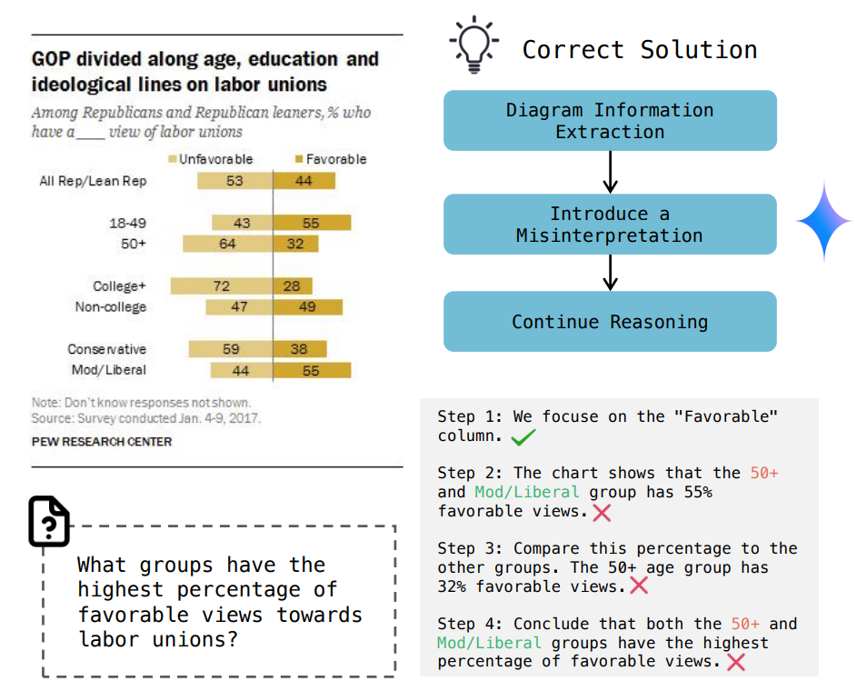

<div align=center>

</div>

<h2 align="center"> URSA: Understanding and Verifying Chain-of-Thought Reasoning in Multimodal Mathematics</h2>

<div align="center">
  <p>
    <a href="https://lrlbbzl.github.io/">Ruilin Luo</a>* , 
    Zhuofan Zheng* , 
    <a href="https://scholar.google.com/citations?user=plGpmz0AAAAJ&hl=en&oi=sra">Yifan Wang</a> , 
    <a href="https://scholar.google.com/citations?user=RxIMGGIAAAAJ&hl=en&oi=ao">Yiyao Yu</a> , 
    <a href="https://scholar.google.com/citations?user=TB0b58kAAAAJ&hl=en&oi=ao">Xinzhe Ni</a> , 
    <a href="https://scholar.google.com/citations?user=DTEfT5EAAAAJ&hl=en&oi=ao">Zicheng Lin</a>, 
    Jin Zeng†, 
    <a href="https://sites.google.com/view/iigroup-thu/home">Yujiu Yang</a>†
  </p>
  <p>
    * Equal Contribution † Corresponding Authors
  </p>
  <p>
    <strong>Tsinghua University, Bytedance</strong>
  </p>
</div>

## 📣 Updates
- **[2025.01.27]**: 🎉🎉🎉 URSA has been accepted to NeurIPS 2025 Main Track. See you in San Diego!
 
- **[2025.01.27]**: URSA-8B has taken the lead in the 4-10B size MLLMs on the [Opencampass LMM Reasoning Leaderboard](https://rank.opencompass.org.cn/leaderboard-multimodal-reasoning/?m=REALTIME), contributing to the SOTA on Math-Vision. Evaluation of URSA has been supported by [VLMEvalKit](https://github.com/open-compass/VLMEvalKit).

- **[2025.01.22]**: [URSA-8B](https://huggingface.co/URSA-MATH/URSA-8B) and [URSA-RM-8B](https://huggingface.co/URSA-MATH/URSA-RM-8B) have been released, along with open-sourced inference code powered by [vLLM](https://github.com/vllm-project/vllm)!

- **[2025.01.08]**: Our paper is released on Arxiv [Paper](https://arxiv.org/abs/2501.04686). And training data is open-sourced on Huggingface [Dataset](https://huggingface.co/URSA-MATH)!
---

## 🔥 Highlights

**URSA-8B** is the first small-sized MLLM specifically focused on Chain-of-thought multimodal mathematical reasoning.

**URSA-RM-8B** is the first open-source, small-sized reward model that operates in multimodal mathematics.

- We conduct extensive evaluations on **six** mathematical benchmarks (MathVista, MathVerse, Dynamath, GeoQA, Math-Vision and We-Math). URSA-8B outperforms similarly sized general and math MLLMs such as **Qwen2-VL**, **InternVL2.5-8B**, and **InfiMM-Math**, as well as closed-source models like **GPT-4V**, **Gemini-1.5-002-Flash**, and **Gemini1.5-Pro**.

- When conducting system-2 reasoning with the verification of URSA-RM-8B, URSA-8B is able to surpass state-of-the-art MLLMs such as **GPT-4o** on datasets like MathVision and MathVerse! **(55.0 vs. 50.8, 35.2 vs. 30.4)**

---

## 📚 Introduction

**Three stages training**

We adopt a three-stage training strategy, including Vision-Language Alignment, Math Instruction Fine Tuning, and PRM Training. Our model architecture employs a hybrid vision tower and Qwen-2.5-Math-Instruct, connecting them using an MLP.

<div align=center>

</div>

**CoT Reasoning Augmentation**

We design the CoT reasoning data synthesis through a triple strategy of distillation, trajectory rewriting, and style naturalization, resulting in the [MMathCoT-1M](https://huggingface.co/datasets/URSA-MATH/MMathCoT-1M) instruction fine-tuning data.

<div align=center>

</div>

**System2 reasoning-like Scaling**

We continue training the reward model based on URSA-8B, aiming to transform CoT reasoning capabilities into supervised capabilities. We design a Dual-view process supervision data synthesis, including binary error localization and visual misinterpretation insertion, to construct data that focuses on both logical and visual perspectives. It results in [DualMath-1.1M](https://huggingface.co/datasets/URSA-MATH/DualMath-1.1M).

<div align=center>

</div>

---

## 🏆 Leaderboards

**Table 1:** Comparison of major MLLMs on six widely-used multimodal mathematical benchmarks. For WE-MATH, we employ **strict metrics**. For DYNAMATH, we report **average accuracy**. For Math-Vision, we use full set for comprehensive evaluation. The notation **URSA-8B + URSA-RM-8B** indicates that URSA-8B is used as a 32-time reasoning trajectory sampler, and URSA-RM-8B is utilized to select the final answer.

<div align="center">

| **Model**                   | MathVerse | MathVista-GPS | WE-MATH  | DYNAMATH | Math-Vision | GeoQA    |
| --------------------------- | --------- | ------------- | -------- | -------- | ----------- | -------- |
| GPT-4o                      | 50.8      | 64.7          | **42.9** | **63.7** | 30.4        | -        |
| GPT-4V                      | 39.4      | 50.5          | 31.1     | -        | 22.8        | 45.2     |
| Gemini-1.5-Pro              | 35.3      | -             | 26.4     | 60.5     | 19.2        | -        |
| Gemini-1.5-Flash-002        | 49.4      | -             | -        | -        | -           | -        |
| Qwen2-VL                    | 33.6      | 40.9          | 25.6     | 42.1     | 16.3        | -        |
| InternVL2-8B                | 35.9      | 62.0          | 26.6     | 39.7     | 18.4        | -        |
| InternVL2-26B               | 33.4      | 58.2          | -        | 41.0     | 17.0        | -        |
| InternVL2-40B               | 37.6      | 54.8          | -        | 41.8     | 16.9        | -        |
| InternVL2.5-8B              | 39.5      | 64.9          | -        | -        | 19.7        | -        |
| InternVL2.5-26B             | 40.1      | 68.8          | -        | -        | 23.1        | -        |
| Math-LLaVA-13B              | 22.9      | 57.7          | 11.1     | -        | 15.7        | -        |
| Multimath                | 27.7      | 66.8          | -        | -        | 16.3        | 67.7     |
| Math-PUMA-Qwen2-7B          | 33.6      | 48.1          | 19.2     | -        | 14.0        | 63.6     |
| URSA-8B (Ours)              | 45.7      | 79.3          | 32.2     | 44.7     | 26.2        | **73.5** |
| URSA-8B + URSA-RM-8B (Ours) | **55.0**  | **86.4**      | -        | -        | **35.2**    | -        |

</div>

Please refer to our paper to see the specific performance on these benchmarks!

---

## 🔨 Usage

### Dataset 

The total training datasets are available on Huggingface: [URSA-MATH](https://huggingface.co/URSA-MATH).


### Inference

We have adapted the URSA-8B architecture into the vllm project, so you can enjoy faster inference using vllm!

Step 1: Configure vllm.

```sh
bash start.sh
```

Step 2: Configure the inference script located at `./inference/start_vllm_infer.sh`. We use mathvista as an example.

```shell
TEMPERATURE=0.2
DATASET="mathvista" # dynamath, wemath, mathvista, mathverse, mathvision
IMAGE_ROOT="" # PATH_TO_IMAGE_ROOT
GENERATE_NUM=1

OUTPUT_FILE="./mathvista_$GENERATE_NUM.jsonl"
DATA_PATH="./data/mathvista/mathvista_testmini.jsonl"
MODEL_PATH="./URSA-8B"

echo "Running inference on data_path: $DATA_PATH"
echo "Save output at $OUTPUT_FILE"

CUDA_VISIBLE_DEVICES=0 python3 inference/vllm_infer.py \
  --model $MODEL_PATH \
  --dataset $DATASET \
  --temperature $TEMPERATURE \
  --data_path $DATA_PATH \
  --output_file $OUTPUT_FILE \
  --image_root $IMAGE_ROOT \
  --num_return_sequences $GENERATE_NUM \
```

Step 3: Start vllm.

```shell
bash ./inference/start_vllm_infer.sh
```

## 📝 Citation

<h5 align="center"> If you find our paper, model, or data helpful, please give this repo a star 🌟 and cite our article ✏️.</h5>

```latex
@article{luo2025ursa,
  title={URSA: Understanding and Verifying Chain-of-thought Reasoning in Multimodal Mathematics},
  author={Luo, Ruilin and Zheng, Zhuofan and Wang, Yifan and Yu, Yiyao and Ni, Xinzhe and Lin, Zicheng and Zeng, Jin and Yang, Yujiu},
  journal={arXiv preprint arXiv:2501.04686},
  year={2025}
}
```
